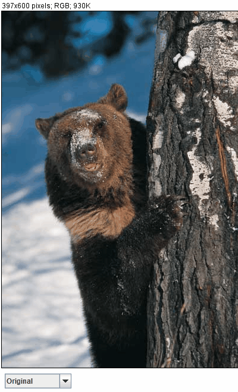

# DigitalMedia3_Bear
Color manipulation exercise. Digital media 2nd semester, 3rd exercise

Goal was to edit color channels, calculate color distances and by that reduce colors
to the most occuring colors, convers to binary image, calculate error diffusion and
sepia color.

